# 🐸 Zump.fun 

**The first on-chain untraceable, unidentifiable, hidden identity-based trading platform on Starknet**

> *"Trade like a ghost. Pump like a god."*

Powered by **Noir zkContracts** + **Garaga accelerated proofs** + **Ztarknet encrypted state**

## 📋 Overview

**Zump.fun** is the world's first fully privacy focused memecoin launchpad on StarkNet, where every transaction is anonymous, untraceable, and unidentifiable. Built with cutting-edge zero-knowledge technology, Zump.fun enables traders to launch and trade memecoins without exposing their identity/primary wallet addresses.

### 🔒 The Privacy Problem

Financial privacy in blockchain is fundamentally broken:

- **Bitcoin's Original Vision**: Privacy and private payments were the core agenda
- **Reality Today**: Platforms like Arkham Intelligence and Dune Analytics make every transaction traceable
- **The Cost**: Fear, inconvenience, and financial losses from targeted attacks on traders
- **Public Ledgers**: Every wallet, every trade, every profit is exposed

**Result**: Traders are vulnerable to front-running, targeted attacks, and loss of financial privacy.

### 🎯 Core Privacy Features

- 👻 **Infinite Untraceable Stealth Accounts** - Each login generates a fresh stealth sub-account
- 🔐 **Zero Wallet Linkability** - Primary wallet cannot identify stealth wallet and vice versa
- 🌑 **Anonymous Token Launches** - Deploy memecoins with zero identity exposure
- 💰 **Private Trading** - Buy and sell without revealing your position
- 🔄 **One Single DarkPool** - Infinite transactions through unified privacy mixer
- 🚀 **Auto DEX Migration** - Seamless transition to public trading when threshold reached
- ⚡ **ZK-Powered** - Noir zkContracts + Garaga accelerated proofs + Ztarknet encrypted state

### 🎯 MVP Features

- ✅ Stealth address generation for every user
- ✅ Anonymous memecoin creation with ZK contracts
- ✅ Private bonding-curve trading (untraceable buy/sell)
- ✅ Hidden liquidity pools with encrypted state
- ✅ Automatic DEX migration at threshold
- ✅ Zero wallet linkability between primary and stealth accounts
- ✅ Nullifier-based transaction privacy

## 🌐 Testnet Deployment

### Network Information

| Property | Value |
|----------|-------|
| **Network** | Starknet Sepolia Testnet |
| **RPC** | `https://rpc.starknet-testnet.lava.build` |
| **Chain ID** | `SN_SEPOLIA` |

### Deployed Contracts

#### Core Contracts

| Contract | Address | Explorer |
|----------|---------|----------|
| ProtocolConfig | `0x008c776746428bad63e71142247ddb24963d8ea68de66733ca76f1f50006b34f` | [Voyager](https://sepolia.voyager.online/contract/0x008c776746428bad63e71142247ddb24963d8ea68de66733ca76f1f50006b34f) |
| PumpFactory | `0x0101c880e4c5289d1db647c94cd0e83227c3b3c1b54814773905095554947814` | [Voyager](https://sepolia.voyager.online/contract/0x0101c880e4c5289d1db647c94cd0e83227c3b3c1b54814773905095554947814) |

#### Privacy & Infrastructure Contracts

| Contract | Address | Explorer |
|----------|---------|----------|
| StealthAddressGenerator | `0x064f0f550c2b7e64d26c21c0952db204eabc92b8f7c00bfe222e4e1081fed92f` | [Voyager](https://sepolia.voyager.online/contract/0x064f0f550c2b7e64d26c21c0952db204eabc92b8f7c00bfe222e4e1081fed92f) |
| CommitmentTree | `0x026ef549f0fd89855c35802895f3cc4bdd682c1184defc8c30a57f091dc312ec` | [Voyager](https://sepolia.voyager.online/contract/0x026ef549f0fd89855c35802895f3cc4bdd682c1184defc8c30a57f091dc312ec) |
| NullifierRegistry | `0x042025d0436d3fb24efc2f54bb80b96374834cb738ce0e97f1dc1403f20103f9` | [Voyager](https://sepolia.voyager.online/contract/0x042025d0436d3fb24efc2f54bb80b96374834cb738ce0e97f1dc1403f20103f9) |
| ZKProofVerifier | `0x058b44f91d29735df077a3c9a2dcf89b3a267e46516a7954687a307781291adf` | [Voyager](https://sepolia.voyager.online/contract/0x058b44f91d29735df077a3c9a2dcf89b3a267e46516a7954687a307781291adf) |
| DarkPoolMixer | `0x04c0c9b0fcbb2f45b31ccda688fb95af193f8b745713fcedc6763f630b1b25e7` | [Voyager](https://sepolia.voyager.online/contract/0x04c0c9b0fcbb2f45b31ccda688fb95af193f8b745713fcedc6763f630b1b25e7) |
| PrivacyRelayer | `0x05933b0cc0bd3926730db1a9746f8610a474e820efacd625371a6fb1cfd1c744` | [Voyager](https://sepolia.voyager.online/contract/0x05933b0cc0bd3926730db1a9746f8610a474e820efacd625371a6fb1cfd1c744) |
| EncryptedStateManager | `0x07067de4049e782c55c9dbd6157e5c97d1224ae76de3fe1912af4e59eed20a44` | [Voyager](https://sepolia.voyager.online/contract/0x07067de4049e782c55c9dbd6157e5c97d1224ae76de3fe1912af4e59eed20a44) |
| LiquidityMigration | `0x0066136ec75eced3807da383b287877a3ee40b78d3190de47b940e0666729790` | [Voyager](https://sepolia.voyager.online/contract/0x0066136ec75eced3807da383b287877a3ee40b78d3190de47b940e0666729790) |
| ZkDexHook | `0x047db2d84db630911902930cc6f9286e4e0ae27fe1eb808fcebf2a45d604117b` | [Voyager](https://sepolia.voyager.online/contract/0x047db2d84db630911902930cc6f9286e4e0ae27fe1eb808fcebf2a45d604117b) |

#### Class Hashes (Declared Contracts)

<details>
<summary>Click to expand class hashes</summary>

| Contract | Class Hash |
|----------|------------|
| ProtocolConfig | `0x0534c30dc743f0da15549d8f1f7b7f1c76e6f65dfa7052b5fb277b5ed471ed0d` |
| MemecoinToken | `0x05760e0c93665dcbe1ee270331b7fc1624e2084d15438f6a9075a3f0dc2a885f` |
| BondingCurvePool | `0x039e341c7a61fe3ed1692a85c464b7f820d67fedafed195449ac1786347654c7` |
| PumpFactory | `0x05a7fc102bf908e819a427eda583d9aa247e3a3d31fe741998ac18f8085fee98` |
| StealthAddressGenerator | `0x03568871d6930a1800dffb51e9f180d341ac7cc436f951bfb6f1a32abd639bfe` |
| CommitmentTree | `0x04a47bd5c77a538ac436d7b4a2966c1e725786e54e7466a40c81621da90172af` |
| NullifierRegistry | `0x0482c6de7a25d10da3b9925349cc2a5f73fa2445b7b3db4e6fdd87a1fca6ea1e` |
| ZKProofVerifier | `0x010fa2ba1e52412addfd0fdc5e3b9054498ec124654aa22522c815ee6595fc78` |
| DarkPoolMixer | `0x073f391fac86d27049af4f2a7253c9d8277829c44837493dd6444d9d55ac580b` |
| PrivacyRelayer | `0x07f0ea59304589e6c802f9b69f4820d5e6a8dbef84e184a8460ce2b125fa28dc` |
| EncryptedStateManager | `0x04be0fd2de378f92618b47d471bcfa5a168efc1ee24cece8fe6eac289ffbe3fe` |
| LiquidityMigration | `0x07447cd3a9b559ca301d22104446bbd4af82238de4d8a9a780aacba5f914ef32` |
| ZkDexHook | `0x02eaf378c05581ed5294168d2c7ec49a0473c82c60a94c0179e84fa0ba8fb165` |

</details>

#### Token Addresses

| Token | Address |
|-------|---------|
| STRK (Quote Token) | `0x04718f5a0fc34cc1af16a1cdee98ffb20c31f5cd61d6ab07201858f4287c938d` |
| ETH | `0x049d36570d4e46f48e99674bd3fcc84644ddd6b96f7c741b1562b82f9e004dc7` |

### Deployment Account

| Property | Value |
|----------|-------|
| **Address** | `0x039d367513530e4ae9851569c73994fabbfebeb08e2609c161756fc88b388046` |
| **Type** | OpenZeppelin Account |

### Frontend Configuration

Update `zump-frontend/src/config/contracts.ts` with the deployed addresses:

```typescript
const SEPOLIA_CONFIG: ContractConfig = {
  addresses: {
    pumpFactory: '0x0101c880e4c5289d1db647c94cd0e83227c3b3c1b54814773905095554947814',
    protocolConfig: '0x008c776746428bad63e71142247ddb24963d8ea68de66733ca76f1f50006b34f',
    quoteToken: '0x04718f5a0fc34cc1af16a1cdee98ffb20c31f5cd61d6ab07201858f4287c938d',
    // Privacy contracts not deployed for MVP
    stealthAddressGenerator: '0x0',
    nullifierRegistry: '0x0',
    zkProofVerifier: '0x0',
  },
  rpcUrl: 'https://rpc.starknet-testnet.lava.build',
  explorerUrl: 'https://sepolia.voyager.online',
  chainId: 'SN_SEPOLIA',
};
```

### Environment Variables

Create a `.env` file in `zump-frontend/`:

```bash
# Starknet Configuration
REACT_APP_STARKNET_NETWORK=sepolia
REACT_APP_STARKNET_RPC_URL=https://rpc.starknet-testnet.lava.build

# Contract Addresses
REACT_APP_PUMP_FACTORY_ADDRESS=0x0101c880e4c5289d1db647c94cd0e83227c3b3c1b54814773905095554947814
REACT_APP_PROTOCOL_CONFIG_ADDRESS=0x008c776746428bad63e71142247ddb24963d8ea68de66733ca76f1f50006b34f
REACT_APP_QUOTE_TOKEN_ADDRESS=0x04718f5a0fc34cc1af16a1cdee98ffb20c31f5cd61d6ab07201858f4287c938d

# Supabase (configure after setup)
REACT_APP_SUPABASE_URL=your_supabase_url
REACT_APP_SUPABASE_ANON_KEY=your_supabase_anon_key
```

### Verification

Verify deployment by calling view functions:

```bash
# Check ProtocolConfig owner
starkli call 0x008c776746428bad63e71142247ddb24963d8ea68de66733ca76f1f50006b34f get_owner --rpc https://rpc.starknet-testnet.lava.build

# Check PumpFactory owner  
starkli call 0x0101c880e4c5289d1db647c94cd0e83227c3b3c1b54814773905095554947814 owner --rpc https://rpc.starknet-testnet.lava.build
```

### Troubleshooting

<details>
<summary>Common Issues & Solutions</summary>

**RPC Rate Limiting**
- Use alternative RPC: `https://starknet-sepolia.g.alchemy.com/v2/YOUR_KEY`
- Or create free account at Infura/Alchemy

**Insufficient Balance**
- Get testnet STRK from: https://starknet-faucet.vercel.app/
- Account needs ~0.01 STRK for deployment

**Invalid Nonce Error**
- Wait a few seconds between transactions
- Network may be congested

**CASM Hash Mismatch**
- Use `--casm-hash` flag with the expected hash from error message
- This happens when network has different compiler version

</details>

## 🏗️ Architecture

### Privacy-First System Overview


### How Zump.fun Works - Three Steps to Ghost Mode

```mermaid
sequenceDiagram
    participant User as 👤 User<br/>(Primary Wallet)
    participant Zump as 👻 Zump.fun
    participant Stealth as 🌑 Stealth Address
    participant ZK as ⚡ ZK Engine
    participant Pool as 💰 Private Pool
    participant DEX as 🏦 Public DEX

    Note over User,DEX: Step 1: Stealth Address Generation
    User->>Zump: Connect with primary wallet
    Zump->>ZK: Generate stealth keypair
    ZK-->>Stealth: Create unlinkable address
    User->>Stealth: Send funds (untraceable)
    Note over Stealth: Primary wallet ≠ Stealth wallet<br/>No linkability possible

    Note over User,DEX: Step 2: Launch Privately
    Stealth->>Zump: Deploy memecoin anonymously
    Zump->>ZK: Generate ZK proof of ownership
    ZK->>Pool: Create private bonding curve
    Note over Pool: Token launched<br/>Creator identity hidden<br/>Until self-declared

    Note over User,DEX: Step 3: Trade & Go Public
    Stealth->>Pool: Private buy/sell (ZK proofs)
    Pool->>Pool: Accumulate liquidity
    Pool-->>Stealth: Private profits
    
    alt Threshold Reached
        Pool->>DEX: Auto-deploy LP
        Note over DEX: Now public trading<br/>But stealth positions<br/>stay private forever
    end
```



### Privacy Technology Stack


### On-chain Contracts

1. **MemecoinToken** - ZK token with private mint/burn via zero-knowledge proofs
2. **BondingCurvePool** - Private trading pool with encrypted state and nullifier checks
3. **PumpFactory** - Anonymous launch registry with stealth address support
4. **ProtocolConfig** - Encrypted protocol variables with ZK-based access control
5. **LiquidityMigration** - Private-to-public transition with LP deployment
6. **PrivacyRelayer** - Off-chain watcher for stealth address monitoring
7. **ZK_DEX_Hook** - Zero-knowledge hooks for DEX integration

### Contract Responsibilities

| Contract | Responsibility | Privacy Feature |
|----------|---------------|-----------------|
| MemecoinToken | ZK with private mint/burn | Encrypted balances, nullifier-based transfers |
| BondingCurvePool | Private bonding curve trading | Hidden reserves, ZK price proofs |
| PumpFactory | Anonymous launch registry | Stealth address deployment, unlinkable launches |
| ProtocolConfig | Encrypted global config | ZK-based parameter updates |
| LiquidityMigration | Private → Public transition | Threshold-based auto-migration |
| PrivacyRelayer | Stealth address monitoring | Off-chain encrypted state sync |
| ZK_DEX_Hook | DEX integration layer | Private liquidity provision |

### Starknet vs EVM Privacy Primitives

| Layer | EVM Version | ❌ Starknet Support | ✅ Zump.fun Solution | Why Better? |
|-------|-------------|-------------------|---------------------|-------------|
| **Cryptographic Curve** | Secp256k1 | ❌ Not native | Stark-friendly EC (Cairo VM) | Efficient ZK proving |
| **Hash Primitive** | SHA3-256 | ⚠️ Supported but slow | **Poseidon / Pedersen Hash** | ZK-optimized, 10x faster |
| **Key Agreement** | ECDH | ❌ Curve mismatch | **ZK Commitments + Note Encryption** | Native zk-rollup mechanism |
| **Stealth Payments** | BIP-352 / EIP-5564 | ❌ EVM only | **SSAP-Stark (Stealth Standard)** | Account abstraction native |
| **Off-chain Logic** | ROFL (TEE) | ❌ Oasis-only | **zkWatcher + Nullifier Scanner** | Pure ZK trust assumptions |
| **Sender Privacy** | Ring Signatures | ❌ Heavy & non-ZK | **Nullifiers + Merkle Tree Notes** | Better scaling & anonymity |

## 💰 Market Opportunity

### The $63B+ Problem


**Market Size**: $63B+ memecoin market cap

**Growing Needs**:
- 🎭 Private degen trading
- 👻 Anonymous token launches  
- 🐋 Invisible whale coordination
- 🌱 Fairer community growth
- 🛡️ Protection from Arkham Intelligence & Dune Analytics

**Why Now?**:
- 90%+ of traders fear wallet exposure
- High-profile doxxing incidents (James Wynn, Hyperliquid reveals)
- Increasing sophistication of on-chain analytics
- Regulatory pressure on transparent transactions

## 🚀 Getting Started

### Prerequisites

- [Scarb](https://docs.swmansion.com/scarb/) (Cairo package manager)
- [Node.js](https://nodejs.org/) (v18+)
- [StarkNet account](https://www.starknet.io/en/developers/account-abstraction) with testnet ETH
- **Privacy mindset** - Understanding of zero-knowledge proofs (helpful but not required)

### Installation


1. **Clone the repository**
   ```bash
   git clone <repository-url>
   cd zump.fun
   ```

2. **Install Scarb** (if not already installed)
   ```bash
   # On macOS/Linux
   curl --proto '=https' --tlsv1.2 -sSf https://docs.swmansion.com/scarb/install.sh | sh
   
   # On Windows (using Scoop)
   scoop install scarb
   
   # Or download from: https://github.com/software-mansion/scarb/releases
   ```

3. **Install Node.js dependencies**
   ```bash
   # Install root dependencies (Cairo tooling)
   npm install
   
   # Install frontend dependencies
   cd zump-frontend
   npm install --legacy-peer-deps
   cd ..
   ```

4. **Set up environment variables**
   ```bash
   cp .env.example .env
   # Edit .env with your StarkNet account details
   ```

### Configuration

Edit `.env` file with your configuration:

```env
NETWORK=sepolia
RPC_URL=https://starknet-sepolia.public.blastapi.io/rpc/v0_7
PRIVATE_KEY=your_private_key_here
ACCOUNT_ADDRESS=your_account_address_here
QUOTE_TOKEN=0x049d36570d4e46f48e99674bd3fcc84644ddd6b96f7c741b1562b82f9e004dc7
```

## 📝 Usage

### Development Workflow


### Build Contracts

```bash
scarb build
```

This compiles all Cairo contracts to Sierra and CASM formats in the `target/dev/` directory.

### Deploy Core Contracts

Deploy the core protocol contracts (ProtocolConfig, PumpFactory, LiquidityMigration):

```bash
npm run deploy
```

This will:
1. Deploy `ProtocolConfig` with initial fee settings
2. Deploy `PumpFactory` for launch registry
3. Deploy `LiquidityMigration` stub
4. Save deployment addresses to `deployments/{NETWORK}.json`

### Create a New Launch

Create a new memecoin launch:

```bash
npm run create-launch <name> <symbol> <basePrice> <slope> <maxSupply> [quoteToken]
```

**Example:**
```bash
npm run create-launch "DogeCoin" "DOGE" "1000000000000000" "1000000000000" "1000000000000000000000000"
```

Parameters:
- `name`: Token name (e.g., "DogeCoin")
- `symbol`: Token symbol (e.g., "DOGE")
- `basePrice`: Starting price in wei (e.g., "1000000000000000" = 0.001 ETH)
- `slope`: Price increase per token sold (e.g., "1000000000000" = 0.000001 ETH)
- `maxSupply`: Maximum tokens to mint (e.g., "1000000000000000000000000" = 1M tokens with 18 decimals)
- `quoteToken`: (Optional) Quote token address (defaults to .env QUOTE_TOKEN)

This will:
1. Deploy a new `MemecoinToken`
2. Deploy a new `BondingCurvePool`
3. Link them together
4. Register the launch in `PumpFactory`
5. Save launch info to `deployments/launches.json`

### Start Frontend

```bash
cd zump-frontend
npm start
```

The frontend will be available at `http://localhost:3000`

## 📁 Project Structure

```
zump.fun/
├── src/                          # Cairo source files
│   ├── lib.cairo                # Main library file
│   ├── memecoin_token.cairo     # ERC20 token contract
│   ├── protocol_config.cairo    # Global protocol config
│   ├── bonding_curve_pool.cairo # Bonding curve logic
│   ├── pump_factory.cairo       # Launch registry
│   ├── liquidity_migration.cairo # DEX migration stub
│   ├── privacy_relayer.cairo    # Privacy features (future)
│   └── zk_dex_hook.cairo        # ZK DEX integration (future)
├── zump-frontend/               # React frontend application
│   ├── src/                     # Frontend source code
│   ├── public/                  # Static assets
│   └── package.json             # Frontend dependencies
├── scripts/                      # Deployment scripts
│   ├── deploy.ts                # Deploy core contracts
│   ├── create_launch.ts         # Create new launch
│   └── interact.ts              # Contract interaction
├── deployments/                  # Deployment addresses
│   ├── sepolia.json             # Core contract deployments
│   └── launches.json            # Launch registry
├── tests/                       # Test files
│   └── test_memecoin_token.cairo # Token tests
├── target/                       # Compiled contracts (generated)
├── Scarb.toml                   # Scarb configuration
├── package.json                 # Node.js dependencies
└── README.md                    # This file
```

### Module Dependencies


## 🔧 Contract Details

### Private Trading Flow

```mermaid
sequenceDiagram
    participant User as 👤 Primary Wallet
    participant Stealth as 👻 Stealth Wallet
    participant ZK as ⚡ ZK Engine
    participant Pool as 💰 Private Pool
    participant Merkle as 🌳 Merkle Tree
    participant Null as 🔒 Nullifier Set
    participant Token as 🪙 ZK-Token

    Note over User,Token: Private Buy Flow (Untraceable)
    User->>Stealth: Generate stealth address
    Stealth->>ZK: Create buy proof (amount hidden)
    ZK->>ZK: Generate ZK-SNARK
    ZK->>Pool: Submit proof + encrypted note
    Pool->>Null: Check nullifier (prevent double-spend)
    Null-->>Pool: Valid (not spent)
    Pool->>Pool: Calculate cost (encrypted)
    Pool->>Merkle: Add commitment to tree
    Pool->>Token: Mint to encrypted address
    Token-->>Stealth: Tokens received (balance hidden)
    
    Note over User,Token: Observer sees: Nothing linkable

    Note over User,Token: Private Sell Flow (Untraceable)
    Stealth->>ZK: Create sell proof (position hidden)
    ZK->>ZK: Generate ZK-SNARK + nullifier
    ZK->>Pool: Submit proof + nullifier
    Pool->>Null: Mark nullifier as spent
    Pool->>Merkle: Verify membership proof
    Merkle-->>Pool: Valid commitment
    Pool->>Token: Burn from encrypted address
    Pool->>Stealth: Refund (amount hidden)
    
    Note over User,Token: Observer sees: Nothing linkable
    Note over User,Token: Primary wallet ≠ Stealth wallet<br/>No connection possible
```



### Stealth Address Architecture


### Anonymous Launch Creation Flow


### DarkPool Mixing Architecture

```mermaid
graph TB
    subgraph "Input Layer - Multiple Stealth Wallets"
        S1[👻 Stealth 1]
        S2[👻 Stealth 2]
        S3[👻 Stealth 3]
        SN[👻 Stealth N]
    end
    
    subgraph "DarkPool Mixer - One Unified Pool"
        DP[🌑 DarkPool<br/>Infinite Mixing]
        MT[Merkle Tree<br/>Commitments]
        NS[Nullifier Set<br/>Spent Notes]
        ZKV[ZK Verifier<br/>Proof Validation]
    end
    
    subgraph "Output Layer - Unlinkable"
        O1[💰 Output 1]
        O2[💰 Output 2]
        O3[💰 Output 3]
        ON[💰 Output N]
    end
    
    S1 -->|Deposit + Proof| DP
    S2 -->|Deposit + Proof| DP
    S3 -->|Deposit + Proof| DP
    SN -->|Deposit + Proof| DP
    
    DP --> MT
    DP --> NS
    DP --> ZKV
    
    DP -->|Withdraw + Proof| O1
    DP -->|Withdraw + Proof| O2
    DP -->|Withdraw + Proof| O3
    DP -->|Withdraw + Proof| ON
    
    style DP fill:#1a1a1a
    style MT fill:#9370DB
    style NS fill:#9370DB
    style ZKV fill:#9370DB
    style S1 fill:#1a1a1a
    style S2 fill:#1a1a1a
    style S3 fill:#1a1a1a
    style SN fill:#1a1a1a
```



### MemecoinToken

Standard ERC20 token with additional mint/burn functionality controlled by the bonding curve pool.

**Key Functions:**
- `mint(to, amount)` - Only callable by minter (pool)
- `burn(from, amount)` - Only callable by minter (pool)
- `update_minter(new_minter)` - Transfer minter role

### BondingCurvePool

Implements a linear bonding curve: `price = base_price + slope * tokens_sold`

**Key Functions:**
- `buy(amount_tokens)` - Buy tokens at current price
- `sell(amount_tokens)` - Sell tokens back to pool
- `get_current_price()` - Get current token price
- `set_migrated()` - Mark pool as migrated (disables trading)

**Price Calculation:**
- Linear curve: `current_price = base_price + (slope * tokens_sold)`
- Protocol fee deducted on buy/sell
- Fees sent to protocol treasury

### Privacy Guarantees - What's Hidden vs Visible


### Private Bonding Curve (Hidden Positions)


### Complete Privacy Flow - End to End


### PumpFactory

Registry for all launches. Frontend can query all launches and their details.

**Key Functions:**
- `register_launch(...)` - Register a new launch
- `get_launch(launch_id)` - Get launch details
- `total_launches()` - Get total number of launches
- `mark_migrated(launch_id)` - Mark launch as migrated

### ProtocolConfig

Global protocol configuration that can be updated by owner.

**Key Functions:**
- `get_fee_config()` - Get fee percentage and receiver
- `set_fee_config(fee_bps, fee_receiver)` - Update fees (owner only)
- `get_curve_limits()` - Get allowed curve parameters
- `set_curve_limits(...)` - Update limits (owner only)

### LiquidityMigration

Stub contract for future DEX migration functionality.

**Key Functions:**
- `migrate_stub(launch_id, pool_addr)` - Mark pool as migrated (owner only)

### Migration Flow (Future)


### Contract State Diagram


1. **Arithmetic Safety**
   - Add overflow checks for all arithmetic operations
   - Use safe math libraries
   - Validate all input parameters

2. **Access Control**
   - Implement proper access controls on migration functions
   - Multi-signature for critical operations
   - Role-based permissions

3. **Anti-Bot Protection**
   - Add rate limiting and anti-bot measures
   - Cooldown periods between trades
   - Maximum wallet limits

4. **Mathematical Validation**
   - Audit bonding curve math for edge cases
   - Test extreme values
   - Validate price calculations

5. **Liquidity Protection**
   - Implement proper LP locking mechanisms
   - Timelock for migrations
   - Emergency pause functionality

6. **Testing & Auditing**
   - Add comprehensive test coverage
   - Professional security audit
   - Formal verification of critical functions

## 📚 Resources

- [StarkNet Documentation](https://docs.starknet.io/)
- [Cairo Book](https://book.cairo-lang.org/)
- [Scarb Documentation](https://docs.swmansion.com/scarb/)
- [StarkNet.js](https://www.starknetjs.com/)

## 🎯 Vision & Roadmap

### Zump.fun: Privacy Infrastructure for Web3


### Beyond Memecoins

**Zump.fun is the proof of concept** of what's possible with private stealth addresses.

**Endless Possibilities**:
- 💳 **Private Payments** - Credit/debit card transactions without traces
- 🌉 **Cross-Chain Privacy** - Bridge assets anonymously between chains
- 🗑️ **Disposable Wallets** - Single-use addresses for maximum privacy
- 🏦 **Institutional Privacy** - Hedge fund-grade confidential trading
- 🛡️ **Anti-Doxxing** - End to wallet tracking and targeted attacks
- 🌐 **Privacy Infrastructure** - Building blocks for private DeFi

**No more**:
- ❌ James Wynn-style exposures
- ❌ Hyperliquid wallet reveals
- ❌ Arkham Intelligence tracking
- ❌ Targeted attacks on traders
- ❌ Front-running by bots
- ❌ Whale wallet monitoring

**Yes to**:
- ✅ True financial privacy
- ✅ Anonymous trading
- ✅ Protected positions
- ✅ Fair market participation
- ✅ Ghost-mode operations
- ✅ Untraceable wealth

---

Built with 👻 for Privacy Maximalists on StarkNet

*"In crypto, privacy is not a feature. It's a fundamental right."*

